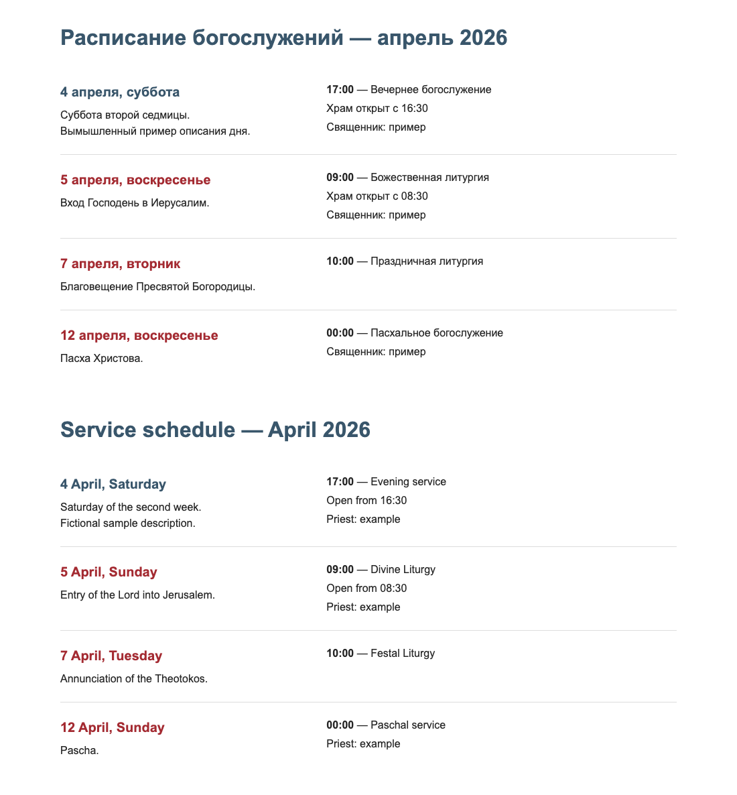

# Генератор расписания богослужений

Из расписания за один месяц создаётся самостоятельный HTML-блок для сайта. На каждый язык нужен свой текст, JSON и HTML. Перевод инструмент не делает.

## Если вы не программист

1. Откройте ChatGPT, Claude или другой чат с нейросетью. Скопируйте **весь** [готовый промпт](prompts/schedule-to-json.md), вставьте его в чат и сразу после него добавьте свой текст расписания. Если нейросеть задаст вопрос о неясной дате, времени или службе, ответьте ей; не просите угадать.
2. Скопируйте JSON из ответа в файл `schedule.json` в этой папке, рядом с `settings.json` и папкой `src`. В файле должен быть сам JSON, без фразы-подсказки и без строк ```.
3. Откройте терминал в этой папке и выполните `python3 src/generate.py --check schedule.json`. Если появится ошибка, скопируйте её в тот же чат и попросите исправить JSON. Затем выполните `python3 src/generate.py schedule.json schedule.html`. Нужен Python 3.10+; устанавливать пакеты не нужно.
4. Откройте `schedule.html` и скопируйте всё его содержимое в блок пользовательского HTML на сайте. В Тильде это T123, в WordPress — «Произвольный HTML»; в другом конструкторе найдите «Свой HTML». Для каждой языковой страницы используйте её отдельный HTML.

Если вы работаете в Claude Code, Codex или другом агенте с доступом к файлам, дайте ему исходный текст и попросите создать HTML по `AGENTS.md`. Агент сам сохранит JSON, проверит его и назовёт путь к HTML.

## Если вы программист

Приведите своё расписание к [схеме входа](schema/month.schema.json) вручную или с помощью нейросети. Пример пары «исходный текст → JSON»: [русский](examples/raw_ru.txt) → [JSON](examples/month_ru.json), [английский](examples/raw_en.txt) → [JSON](examples/month_en.json). Это полностью вымышленные данные. Парсер кривого текста в программу не входит: преобразование требует понимания исходника и уточнения неоднозначностей.

```bash
python3 src/generate.py --check examples/month_ru.json
python3 src/generate.py examples/month_ru.json output/month_ru.html
python3 src/generate.py --check examples/month_en.json
python3 src/generate.py examples/month_en.json output/month_en.html
python3 -m unittest discover -s tests -v
```



## Контракт JSON

Один UTF-8 JSON-файл описывает один месяц и один язык. Полная схема — [`schema/month.schema.json`](schema/month.schema.json). Краткий вид:

```json
{
  "year": 2026,
  "month": 4,
  "language": "ru",
  "days": [
    {
      "date": "2026-04-07",
      "description": ["Описание дня"],
      "services": [
        {"time": "10:00", "title": "Название службы", "hours": "", "priest": ""}
      ]
    }
  ]
}
```

`year` — 1900–2099; `month` — 1–12; `language` — код из `settings.json`. `date` — гражданская дата `YYYY-MM-DD` внутри этого месяца. Даты не повторяются, порядок дней не важен. `description` — массив текстовых строк. `services` — массив служб; поля `time`, `title`, `hours`, `priest` обязательны у каждой службы; `title` не может быть пустым. Время — `HH:MM` (24 часа); отсутствующие в источнике часы работы и священник — пустые строки. Если для дня нет служб, `services` — `[]`. Лишние поля отвергаются. Все строки безопасно экранируются при выводе в HTML.

Проверка `--check` не создаёт HTML. Ошибка называет день, поле, проблему и способ исправления; её можно отдать нейросети. Если JSON синтаксически сломан, будет указана строка и столбец. Генератор выводит день с `data-schedule-date="YYYY-MM-DD"`.

## Календарь и настройки

Воскресенья, Пасха и двунадесятые праздники выделяются красным по календарному расчёту, а не по заглавным буквам в тексте. Пасха считается по юлианскому правилу; неподвижные праздники переводятся из старого стиля в гражданские даты. Дополнительные даты можно указать вручную.

Всё настраивается в `settings.json` (контракт — [`schema/settings.schema.json`](schema/settings.schema.json)): `colors.text`, `colors.accent`, `colors.red` — шестизначные цвета HEX; `font_family` — системные шрифты; `max_width_px` — ширина; `additional_highlight_dates` — дополнительные даты `YYYY-MM-DD` (по умолчанию пусто). В `languages` у каждого кода задаётся заголовок `title`; `months` содержит 12 форм для заголовка месяца (например, «апрель 2026»), необязательное `day_months` — 12 форм для даты дня (например, «4 апреля»), а также `weekdays` — 7 дней недели с понедельника по воскресенье. Если `day_months` нет, используются `months`; для английского обе формы совпадают. Языков может быть сколько угодно. Другой файл настроек: `--settings путь/к/settings.json`.

HTML содержит встроенные стили, ограниченные классом `.orthodox-schedule`, и адаптируется к узкому экрану. Внешние шрифты, скрипты и сетевые ресурсы не нужны. Некоторые платформы удаляют `<style>`; в таком случае CSS нужно добавить разрешённым платформой способом. Готовые образцы находятся в `output/`; оба сразу можно открыть через `examples/preview.html`.

## Если у вас иначе

Можно дополнить шаблон вручную или попросить агента. Пример запроса:

> Добавь необязательное поле `note` к каждой службе. Обнови схему, промпт, проверку, рендерер, примеры, README и тесты. Сохрани экранирование HTML, `data-schedule-date` и календарное выделение. Не добавляй разбор текста по ключевым словам.

Лицензия: MIT.
